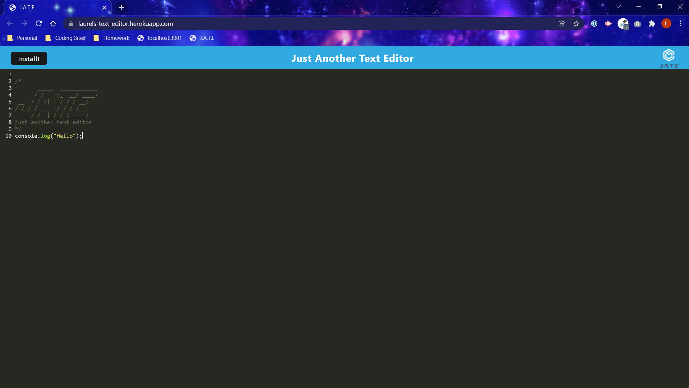
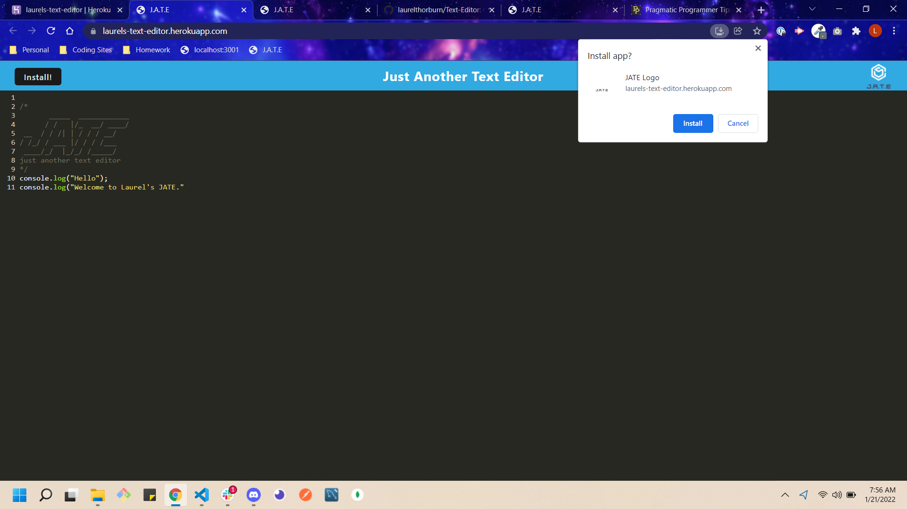

# Text-Editor

<a name="descsection"></a>
## Description
Welcome to J.A.T.E, or "just another text editor".  JATE is a text editor that runs in the browser. This app is a single-page application that meets the PWA criteria. Additionally, it features a number of data persistence techniques that serve as redundancy in case one of the options is not supported by the browser. The application also functions offline, lucky you.

[](https://opensource.org/licenses/MIT)


## Table of Contents
1. [ Description. ](#descsection)
3. [ Installation. ](#installsection)
4. [ License. ](#licensesection)
5. [ Contributing. ](#contribsection)
6. [ Tests. ](#testsection)
7. [ Questions. ](#questionssection)
8. [ Screenshots. ](#picsection)
9. [ Links. ](#linksection)
10. [ Resources/Credit. ](#creditsection)

<a name="installsection"></a>
## Installation
* Clone the repository using:
```
git clone https://github.com/laurelthorburn/Text-Editor.git
```
* Ensure you are in the current working directory
* Install dependencies by opening the terminal (ctrl + j on windows) and running:
```
npm install || npm i
```
* Run the project by typing the following in the terminal in order:
```
npm run build 
npm run start
```

<a name="licensesection"></a>
## License
Copyright <2021>

Permission is hereby granted, free of charge, to any person obtaining a copy of this software and associated documentation files (the "Software"), to deal in the Software without restriction, including without limitation the rights to use, copy, modify, merge, publish, distribute, sublicense, and/or sell copies of the Software, and to permit persons to whom the Software is furnished to do so, subject to the following conditions:

The above copyright notice and this permission notice shall be included in all copies or substantial portions of the Software.

THE SOFTWARE IS PROVIDED "AS IS", WITHOUT WARRANTY OF ANY KIND, EXPRESS OR IMPLIED, INCLUDING BUT NOT LIMITED TO THE WARRANTIES OF MERCHANTABILITY, FITNESS FOR A PARTICULAR PURPOSE AND NONINFRINGEMENT. IN NO EVENT SHALL THE AUTHORS OR COPYRIGHT HOLDERS BE LIABLE FOR ANY CLAIM, DAMAGES OR OTHER LIABILITY, WHETHER IN AN ACTION OF CONTRACT, TORT OR OTHERWISE, ARISING FROM, OUT OF OR IN CONNECTION WITH THE SOFTWARE OR THE USE OR OTHER DEALINGS IN THE SOFTWARE.

  <a name="contribsection"></a>
## Contributing
  
1. [Fork the repo!](https://docs.github.com/en/get-started/quickstart/fork-a-repo)
2. Create a feature branch:
```
git checkout -b yourname-branch
```
3. Commit changes:
```
git commit -m 'Your changes here'
```
4. Push to the branch:
```
git push origin yourname-branch
```
5. Submit a pull request and wait for it to be approved or denied.

  <a name="testsection"></a>
## Tests
No tests at this time

  <a name="questionssection"></a>
## Questions?
  Want to see more of my work? [Click here!](https://github.com/laurelthorburn)

  Questions/comments/concerns? Please send an email to codinglaurel@gmail.com
  

  <a name="picsection"></a>
  ## Screenshots
  
  
  

  <a name="linksection"></a>
  ## Links

  Heroku Site: https://laurels-text-editor.herokuapp.com/
  
  Github Site: https://github.com/laurelthorburn/Text-Editor

  <a name="creditsection"></a>
## Resources/Credit
* Master coder and TA, Samuel Fox, who found the missing space and made magic happen

